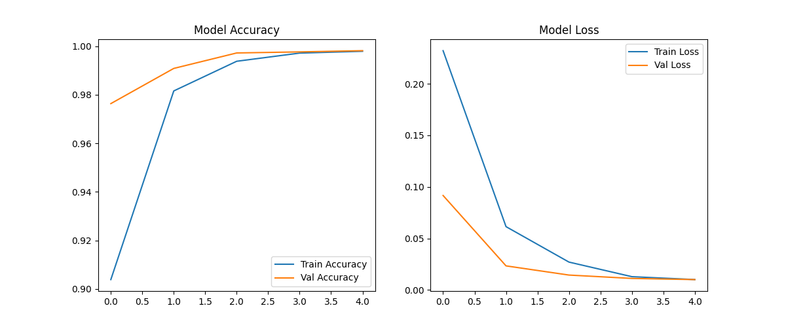
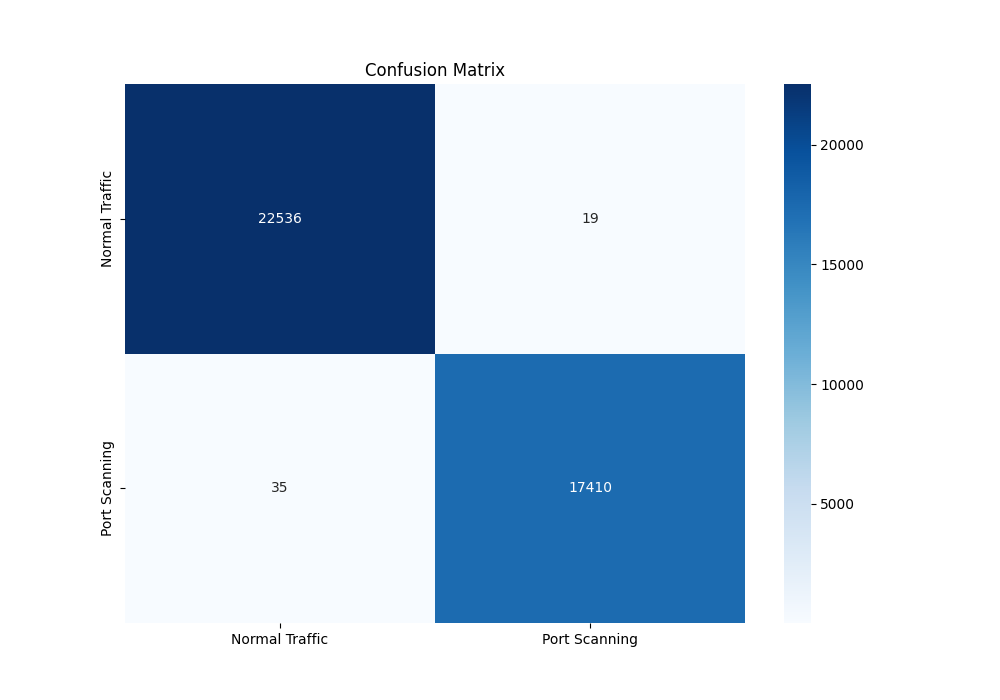
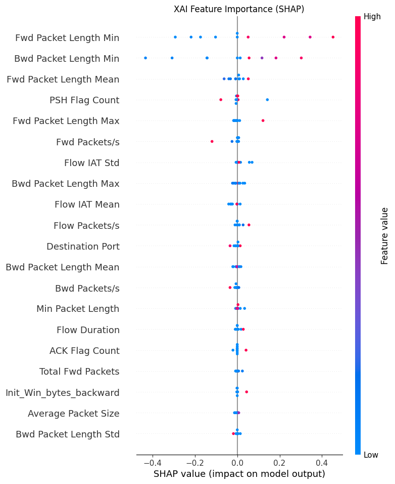

Hybrid Intrusion Detection System with Explainable AI (XAI)
📌 Project Overview

This project presents a Hybrid Intrusion Detection System (IDS) that uses Deep Learning techniques combined with Explainable Artificial Intelligence (XAI) to detect malicious network traffic and explain model predictions.

Traditional IDS systems detect attacks but often behave like black-box models. This project integrates SHAP (SHapley Additive exPlanations) to provide insights into how the model makes decisions.

The system is trained using the CICIDS2017 dataset, which contains realistic network traffic including both normal and attack patterns.

🎯 Objectives

Detect malicious network traffic using a hybrid deep learning model.

Improve cybersecurity detection accuracy.

Apply Explainable AI techniques to interpret predictions.

Visualize model performance using graphs and evaluation metrics.

🧠 Technologies Used

Python

TensorFlow / Keras

Scikit-learn

SHAP (Explainable AI)

Pandas & NumPy

Matplotlib / Seaborn

Jupyter Notebook

📂 Project Structure
Hybrid_IDS_XAI
│
├── models/                  # Saved trained models
│   ├── ids_hybrid_model.h5
│   ├── ids_hybrid_model.keras
│   └── scaler.pkl
│
├── notebooks/               # Jupyter notebooks for experiments
│   ├── 01_data_exploration.ipynb
│   ├── 02_training_model.ipynb
│   └── 03_xai_visualization.ipynb
│
├── results/figures/         # Output graphs and visualizations
│   ├── confusion_matrix.png
│   ├── training_history.png
│   └── xai_shap_plot.png
│
├── src/                     # Source code modules
│   ├── preprocess.py
│   ├── model_arch.py
│   ├── trainer.py
│   └── explainers.py
│
├── main.py                  # Main program
├── requirements.txt         # Python dependencies
├── .gitignore
└── README.md
📊 Project Outputs
1️⃣ Model Training Performance

This graph shows how the model’s accuracy and loss change during training.

2️⃣ Confusion Matrix

The confusion matrix shows how well the IDS model classifies normal traffic and attack traffic.

3️⃣ Explainable AI – SHAP Visualization

SHAP explains the importance of features in model predictions.

📁 Dataset

The dataset used is CICIDS2017.

Due to its large size, it is not included in this repository.

Download it from:
https://www.unb.ca/cic/datasets/ids-2017.html

After downloading, place the dataset in:

data/raw/
⚙️ Installation

Clone the repository:

git clone https://github.com/Sheteanjali/Hybrid_IDS_XAI.git
cd Hybrid_IDS_XAI

Install required dependencies:

pip install -r requirements.txt
▶️ Run the Project

Run the main program:

python main.py

You can also run the notebooks for step-by-step experimentation.

🔍 Explainable AI (XAI)

Explainable AI is integrated using SHAP to understand how the machine learning model makes predictions.

This helps:

Improve trust in AI systems

Identify important network features

Assist cybersecurity analysts in understanding attack detection